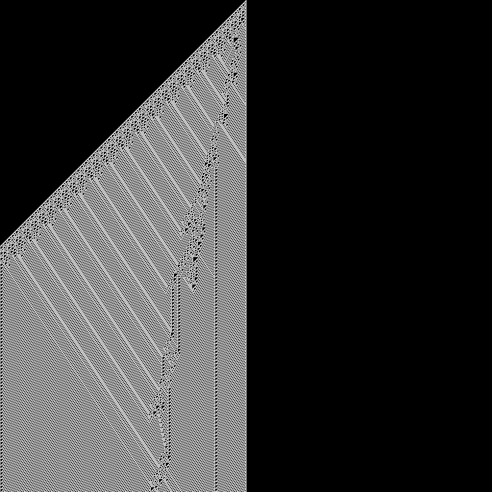
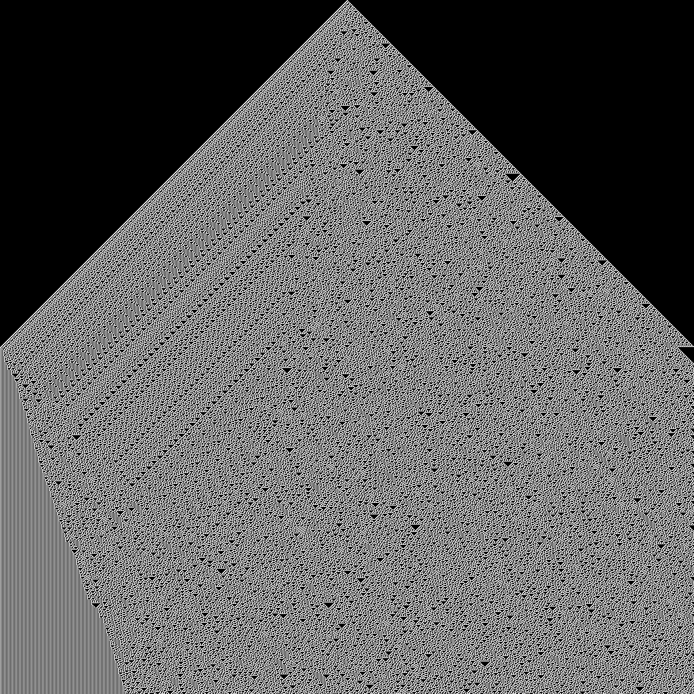

# Sistemas-Complejos
Sistemas complejos modelos y algunos codigos para interactuar con ellos

## Automatas unidmencionales y bidimencionales

Codigo que soporta la presentación grafica de automatas de una dimensión o dos dimenciones.

### Manual documentatorio para unidimencional

El archivo [Notebook](automata.ipynb) genera automatas unidimencionales como los ya hechos en el repositorio, alguno de ellos:

## Detección de anomalias

El codigo trabajado en el taller de detección de anomalias se puede consultar en la siguiente liga [Repositorio](Anomalias/) en esta carpeta el se detalla que se hizo en el curso.

## Clasificación de resonancias a tumores

En el último taller se hizo un analisis de imagenes de resonancias a un paciente para ver si se encontraban elementos que pudieran ayudar a clasificar si el tumor del paciente era de alto o bajo impacto.

Los resultados fueron que al hacer el estudio con su descomposición y todo el modelo debia contemplar una serie de variables algo tecnicas, entre ellas contraste, suma de los promedios, Entropia, segundo momento angular, etc.

Al final el asistente del taller propone dos enfoques, el clasico clasificador logistico multiple y el uso del metodo de vecinos más cercanos. Los resultados de estos dos metodos se puede consultar en el [notebook](Imagenes_procesamiento/CaracteristicasMedicallMages_Actualizada.ipynb)

